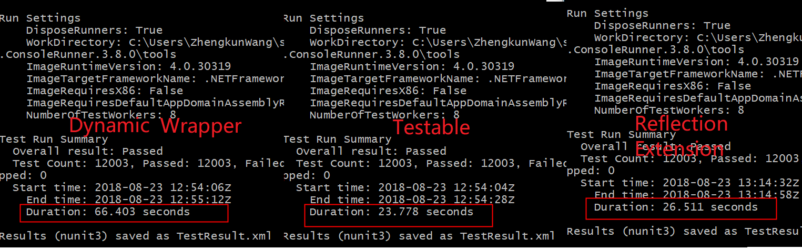

# Reflection Vs Testable Vs Dynamic Wrapper in UnitTest
This is a project which doing the performance test for each kinds of mock implementation, using the `testable` sub class or reflection set method or dynamic wrapper to set a  private field in an unit test,  generated 4000 files with 3 test methods in each file, so in total 12000 test methods.

More details for 3 mock implementation, please refer the blog:

Chinese version: http://www.boydwang.com/2018/08/dynamic_reflection/

Google translated English version: https://bit.ly/2NbpiMb

Here are the test result:


## How to run
1. Build Solution
2. Open a cmd window, cd to `ConsoleApp1\packages\NUnit.ConsoleRunner.3.8.0\tools`
3. Run below command to run all unittest

For reflection implementation:

```bash
./nunit3-console.exe
../../../UnitTestReflectionProject/bin/Debug/UnitTestReflectionProject.dll
```

For testable implementation:
```bash
./nunit3-console.exe ../../../UnitTestProject1/bin/Debug/UnitTestProject1.dll
```

For wrapper implementation:
```bash
./nunit3-console.exe
../../../UnitTestWrapperProject/bin/Debug/UnitTestWrapperProject.dll
```


## Want to generate more files?

1. Exclude the `testfiles` folder in `UnitTestReflectionProject`, `UnitTestTestableProject project` and `UnitTestWrapperProject`
2. Open the Program.cs in ConsoleApp1 project, change the `FILECOUNT` to the number how many test files you want to generate
3. Build and run, wait the program to generate files
4. Include the testfiles folder in `UnitTestReflectionProject`, `UnitTestTestableProject` and `UnitTestWrapperProject` project
5. Rebuild solution


